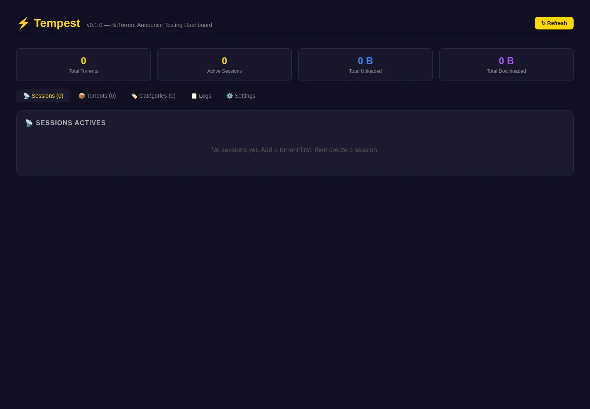

# Tempest ⚡

**A friendly dashboard for testing BitTorrent tracker announces**

Tempest is a self-hosted web application for simulating BitTorrent announce activity in a clean, modern interface. Upload `.torrent` files, organise them into categories with independent speed budgets, and watch announce traffic — all from the browser.

Tempest is for **private labs, QA environments, protocol experiments, demos, and development work only**. It has no application authentication: keep it bound to localhost or behind an authenticated private proxy, and use it only with trackers you are authorised to test. It is not intended for public Internet deployment.




_Captured from an isolated empty demo instance. No real torrent, tracker,
passkey, or operator data is shown._

---

## Features

- **Drag & drop multi-upload** — drop one or many `.torrent` files at once; sessions start automatically
- **Categories** — group torrents by category, each with its own upload/download speed budget, variance, and target ratio
- **Per-category speed allocation** — the engine distributes bandwidth independently within each category
- **Bulk actions** — select multiple torrents to assign or remove categories in one click
- **Multi-instance** — run several Tempest instances on the same host, each with isolated paths, ports, and systemd services
- **`.env` configuration** — override `config.json` values with environment variables (`.env` file or system env)
- **Single-binary backend** — no external database or extra services required
- **Embedded SQLite storage** — easy local setup, easy backup
- **Live dashboard** — stats, logs, seeders/leechers, and announce timing in real time
- **Client profiles** — emulate different BitTorrent client signatures (qBittorrent, Transmission, …)
- **REST API** — every action is available through `/api`

---

## What Tempest does

Tempest focuses on the **tracker side** of BitTorrent workflows.

It can:
- store and inspect `.torrent` metadata
- send HTTP/HTTPS announce requests to trackers
- simulate uploaded/downloaded counters between announce intervals
- emulate different BitTorrent client profiles
- show live logs and session statistics in the browser
- optionally bind traffic to a specific network interface on multi-homed systems

It does **not**:
- download torrent payloads
- connect to peers
- transfer file data
- require PostgreSQL, Redis, or any other external service

---

## Quick start

### Prerequisites

| Tool | Version |
|------|---------|
| Go | 1.24.x |
| Node.js | 24.x (LTS) |
| npm | Bundled with Node.js 24 |
| gcc | Any recent version (required for SQLite/CGO) |

### Run from source

```bash
git clone https://github.com/HeartBtz/tempest.git
cd tempest
make all
make run
```

Then open **http://127.0.0.1:8377**.

---

## Installation

### 1) Install as a system service (recommended)

The install script builds Tempest, creates an unprivileged system user, and registers a hardened systemd service on Linux. Managed launchd installation is not supported; use standalone mode as an unprivileged macOS user.

```bash
sudo ./install.sh
```

The script prompts for:

| Prompt | Default | Notes |
|--------|---------|-------|
| **Instance name** | directory name (e.g. `tempest-prod`) | Used for service name, paths, and system user |
| **HTTP port** | `8377` | Each instance needs a unique port |
| **Bind address** | `127.0.0.1` | Keep loopback-only unless protected by an authenticated private proxy |

After confirmation it builds, copies files, and starts the service.

**Default paths** (derived from the instance name):

| Path | Example (`tempest-prod`) |
|------|--------------------------|
| Binary | `/opt/tempest-prod/tempest` |
| Config | `/etc/tempest-prod/config.json` |
| Data | `/var/lib/tempest-prod/tempest.db` |
| Logs | `/var/log/tempest-prod/` |
| Env file | `/etc/tempest-prod/tempest.env` |

Re-running the installer preserves existing config and environment files and stages the complete deployment before swapping it into place. Health checks resolve the effective listen endpoint after config, service environment, and `.env` overrides; wildcard listeners are probed through the corresponding loopback address. If installation fails, the installer restores the previous files and systemd enabled/disabled and active/inactive states, then verifies health when the restored service was active.

Before changing deployment state, the installer rejects an existing unit whose `User` or `Group` differs from the requested service identity. It also validates existing managed paths, ownership, service access, and non-writable metadata rather than recursively changing their ownership or modes. Installed code, binary, and frontend files remain root-owned and non-writable by the service account; only dedicated data and log directories are writable by it.

For diagnostics, the non-serving command `tempest --config /path/to/config.json --env-file /path/to/tempest.env --health-url` prints the local `/health` URL after applying the same config and environment precedence. `--env-file` is accepted only with `--health-url`.

#### Running multiple instances

Clone the repository into separate directories and run the installer from each one:

```bash
# Instance 1
git clone https://github.com/HeartBtz/tempest.git /opt/tempest-prod
cd /opt/tempest-prod
sudo ./install.sh   # instance name: tempest-prod, port: 8377

# Instance 2
git clone https://github.com/HeartBtz/tempest.git /opt/tempest-dev
cd /opt/tempest-dev
sudo ./install.sh   # instance name: tempest-dev, port: 8378
```

Each instance gets its own systemd service, data directory, config, and log files.

#### Non-interactive install (CI / scripts)

Skip prompts by setting environment variables:

```bash
sudo TEMPEST_APP_NAME=tempest-prod TEMPEST_PORT=8377 ./install.sh
```

### 2) Standalone install

Install without a system service (no root needed):

```bash
./install.sh --standalone
```

### 3) Docker

```bash
# The default binds to 127.0.0.1:8377. Do not publish the port directly.
docker compose up -d --build
```

The default `docker-compose.yml` publishes port `8377` on `127.0.0.1` only and persists data in a named volume. The container runs non-root with a read-only root filesystem, dropped capabilities, and a local health check.

### 4) Manual build

```bash
cd web && npm ci && npm run build && cd ..
mkdir -p build
CGO_ENABLED=1 go build -ldflags "-s -w" -o build/tempest ./cmd/tempest
./build/tempest
```

### Uninstall

```bash
sudo ./install.sh --uninstall
```

This stops the service and removes the systemd unit. Data directories are preserved and listed for manual cleanup.

---

## First run walkthrough

### 1. Upload torrents
Open the **Torrents** tab, drag-and-drop one or more `.torrent` files.
Each torrent is saved and a session is **automatically created and started**.

### 2. Configure settings
Open **Settings** to choose the default client profile and global speed settings.

> Upload and download speeds are **shared across all running sessions** (unless overridden by categories).

### 3. Organise with categories (optional)
Go to the **Categories** tab to create categories with their own speed budgets.
Then select torrents in the **Torrents** tab and assign them to a category.

> Each category distributes its speed budget independently across its own torrents.
> Torrents without a category use the global settings.

### 4. Watch the dashboard
Track in real time:
- total uploaded/downloaded counters
- allocated speed per running session
- seeders/leechers returned by the tracker
- announce intervals and errors
- live event logs

---

## Configuration

### config.json

Tempest looks for a configuration file at startup. Pass it with `--config`:

```bash
./tempest --config /etc/tempest-prod/config.json
```

```json
{
  "server": {
    "host": "127.0.0.1",
    "port": 8377
  },
  "database": {
    "path": "tempest.db"
  },
  "engine": {
    "max_concurrent_sessions": 500,
    "default_announce_port": 6881,
    "enable_randomization": true
  },
  "security": {
    "allow_private_tracker_destinations": false
  }
}
```

### `.env` file

Create a `.env` file in the working directory (or copy `.env.example`):

```bash
cp .env.example .env
```

Environment variables override `config.json` values:

| Variable | Default | Description |
|----------|---------|-------------|
| `TEMPEST_HOST` | `127.0.0.1` | Bind address |
| `TEMPEST_PORT` | `8377` | HTTP port |
| `TEMPEST_DB_PATH` | `tempest.db` | SQLite database path |
| `TEMPEST_MAX_SESSIONS` | `500` | Maximum concurrent sessions |
| `TEMPEST_ANNOUNCE_PORT` | `6881` | Default announce port |
| `TEMPEST_ENABLE_RANDOMIZATION` | `true` | Enable speed randomization |
| `TEMPEST_ALLOW_PRIVATE_TRACKERS` | `false` | Explicitly allow private/loopback/link-local tracker destinations for an isolated authorised lab |
| `TEMPEST_ALLOWED_HOSTS` | empty | Comma-separated hostnames or IP addresses accepted in HTTP `Host` headers in addition to localhost; do not include schemes, ports, or wildcards |
| `TEMPEST_ALLOWED_ORIGINS` | empty | Comma-separated exact browser origins (`http://` or `https://`, including any non-default port) allowed for protected reverse-proxy or LAN access |

> `.env` is gitignored. The committed `.env.example` documents all supported variables.

By default, tracker requests reject loopback, private, link-local, unspecified,
and multicast destinations, and redirects are checked again. Only set
`TEMPEST_ALLOW_PRIVATE_TRACKERS=true` when an isolated lab must intentionally
reach an authorised private tracker. See [SECURITY.md](SECURITY.md).

Tempest accepts localhost hosts and same-origin browser requests by default.
Leave both allowlists empty for localhost-only use. For an authenticated private
reverse proxy, keep `TEMPEST_HOST=127.0.0.1` and explicitly list the proxy's
public hostname and browser origin, for example:

```dotenv
TEMPEST_ALLOWED_HOSTS=tempest.example.lan
TEMPEST_ALLOWED_ORIGINS=https://tempest.example.lan
```

For direct access on a trusted LAN, bind deliberately and list every hostname or
address and origin clients use. Do not use wildcard values:

```dotenv
TEMPEST_HOST=0.0.0.0
TEMPEST_ALLOWED_HOSTS=tempest.lan,192.168.1.50
TEMPEST_ALLOWED_ORIGINS=http://tempest.lan:8377,http://192.168.1.50:8377
```

These settings only define accepted request boundaries; they do not add
authentication or make Internet exposure safe.

### Install-time environment variables

These are used by `install.sh` to configure paths and the systemd service:

| Variable | Default | Purpose |
|----------|---------|---------|
| `TEMPEST_APP_NAME` | directory name | Instance name (service, paths, user) |
| `TEMPEST_PORT` | `8377` | HTTP port |
| `TEMPEST_HOST` | `127.0.0.1` | Bind address |
| `TEMPEST_INSTALL_DIR` | `/opt/<APP_NAME>` | Binary location |
| `TEMPEST_DATA_DIR` | `/var/lib/<APP_NAME>` | Database location |
| `TEMPEST_LOG_DIR` | `/var/log/<APP_NAME>` | Log files |
| `TEMPEST_CONFIG_DIR` | `/etc/<APP_NAME>` | Config and env file |
| `TEMPEST_USER` | `<APP_NAME>` | System user |

---

## REST API

Tempest exposes a JSON API under `/api`.

`GET /health` returns `{"status":"ok","version":"MAJOR.MINOR.PATCH"}`. Release
builds inject the exact protected-tag SemVer, allowing deployment tooling to
verify what is actually serving rather than infer deployment from a pipeline.
See [the release contract](docs/RELEASE.md); production deployment is currently
blocked because no dedicated forced receiver is documented.

### Torrents

| Method | Endpoint | Description |
|--------|----------|-------------|
| `GET` | `/api/torrents` | List all torrents with stats |
| `POST` | `/api/torrents` | Upload `.torrent` files (multipart field `torrent`; 2 MiB/file, 10 MiB/request) |
| `GET` | `/api/torrents/:id` | Get a single torrent |
| `DELETE` | `/api/torrents/:id` | Delete a torrent and its sessions |

### Sessions

| Method | Endpoint | Description |
|--------|----------|-------------|
| `GET` | `/api/sessions` | List all sessions |
| `POST` | `/api/sessions` | Create a session |
| `GET` | `/api/sessions/:id` | Get session details |
| `PUT` | `/api/sessions/:id` | Update session settings |
| `DELETE` | `/api/sessions/:id` | Delete a session |
| `POST` | `/api/sessions/:id/start` | Start announcing |
| `POST` | `/api/sessions/:id/stop` | Stop announcing |

### Categories

| Method | Endpoint | Description |
|--------|----------|-------------|
| `GET` | `/api/categories` | List all categories |
| `POST` | `/api/categories` | Create a category |
| `GET` | `/api/categories/:id` | Get category details |
| `PUT` | `/api/categories/:id` | Update a category |
| `DELETE` | `/api/categories/:id` | Delete a category |
| `PUT` | `/api/categories/:id/assign` | Assign torrents to a category |
| `PUT` | `/api/categories/unassign` | Remove torrents from their category |

### Other

| Method | Endpoint | Description |
|--------|----------|-------------|
| `GET` | `/api/stats` | Global statistics |
| `GET/PUT` | `/api/settings` | Get or update global settings |
| `GET` | `/api/logs` | Recent event logs |
| `GET` | `/api/profiles` | Available client profiles |
| `GET` | `/api/interfaces` | Network interfaces |

---

## Development

### Common commands

```bash
make all            # Build frontend + backend
make backend        # Build Go backend only
make frontend       # Build React frontend only
make run            # Build and run
make test           # Run Go/frontend tests, frontend build, and installer checks (Node.js 24)
make clean          # Remove build artifacts
make docker         # Build Docker image
```

### Frontend / backend split in development

```bash
# Terminal 1 — backend with hot reload
make dev-backend

# Terminal 2 — frontend dev server with HMR
cd web && npm run dev
```

### Project structure

```
tempest/
├── cmd/tempest/         # Application entry point
├── internal/
│   ├── api/             # HTTP server, routes, middleware
│   │   └── handler/     # Request handlers (torrent, session, category, …)
│   ├── client/          # BitTorrent client profile emulation
│   ├── config/          # Config loading (.env, JSON, env overrides)
│   ├── engine/          # Announce engine and speed allocation
│   ├── protocol/        # Torrent file parsing, bencode
│   └── storage/         # SQLite database, models, migrations
├── web/                 # React + TypeScript frontend (Vite)
│   └── src/
│       ├── api/         # API client
│       ├── components/  # UI components
│       └── types/       # TypeScript interfaces
├── .env.example         # Documented environment variables
├── docs/screenshots/    # Synthetic previews only
├── install.sh           # Interactive install script
├── Dockerfile           # Multi-stage Docker build
├── docker-compose.yml   # Docker Compose configuration
└── Makefile             # Build automation
```

---

## FAQ

### Does Tempest download files?
No. Tempest does not fetch torrent payload data.

### Does Tempest connect to peers?
No. Tempest focuses on tracker announces only.

### Which trackers are supported?
HTTP and HTTPS trackers. UDP tracker support is not implemented yet.

### Can I run multiple instances?
Yes. The install script derives all paths and service names from the directory name. Clone into different directories, run `./install.sh` in each, and pick different ports.

### Is there a web interface?
Yes. The UI is served from the same binary on the configured port.

### Where is my data stored?
In a local SQLite database. Default path: `tempest.db` (or `<DATA_DIR>/tempest.db` when installed as a service).

### How does category speed allocation work?
Each category has its own upload/download speed budget. The engine distributes that budget evenly across all running sessions in the category. Torrents without a category use the global speed settings.

---

## Responsible use

Use Tempest only with systems and services you are authorised to test.

See [SECURITY.md](SECURITY.md) for the network boundary and vulnerability-reporting policy.
Contributions are welcome under the scope and validation rules in [CONTRIBUTING.md](CONTRIBUTING.md).

---

## License

MIT — see [LICENSE](LICENSE).
